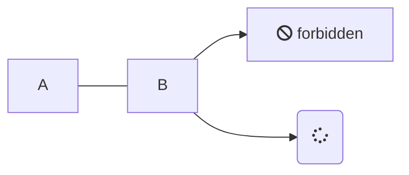
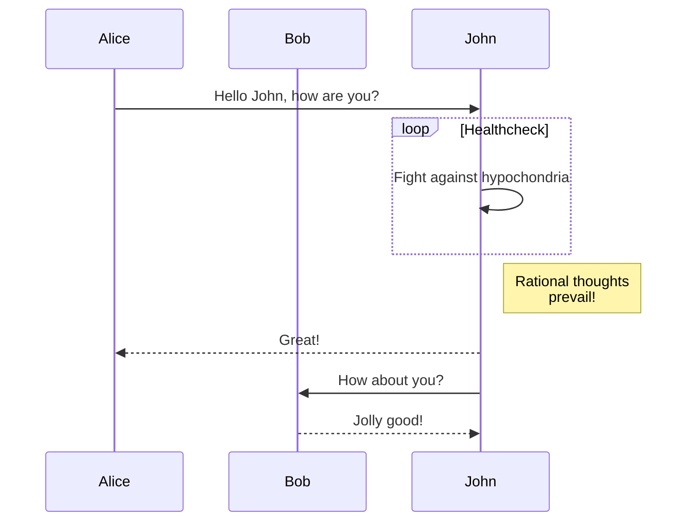

# Plugins

## Image zoom
- 圖片無縮放<br />
    ```md
    
    ```
    
- 圖片可縮放<br />
    ```md
    
    ```
    

## Copy to clipboard
```text
hi，程式碼區塊有引用 Copy to clipboard
```

## Language Highlight
```html
<p>This is a paragraph</p>
<a href="//docsify.js.org/">Docsify</a>
```
```bash
echo "hello"
```
```php
function getAdder(int $x): int 
{
    return 123;
}
```

## Mermaid
```md
graph LR
    A --- B
    B-->C[fa:fa-ban forbidden]
    B-->D(fa:fa-spinner);
```

----
```md
sequenceDiagram
    participant Alice
    participant Bob
    Alice->>John: Hello John, how are you?
    loop Healthcheck
        John->>John: Fight against hypochondria
    end
    Note right of John: Rational thoughts <br/>prevail!
    John-->>Alice: Great!
    John->>Bob: How about you?
    Bob-->>John: Jolly good!
```

